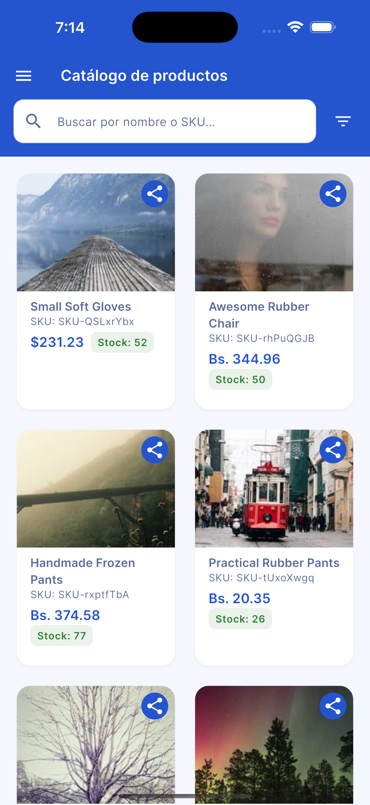
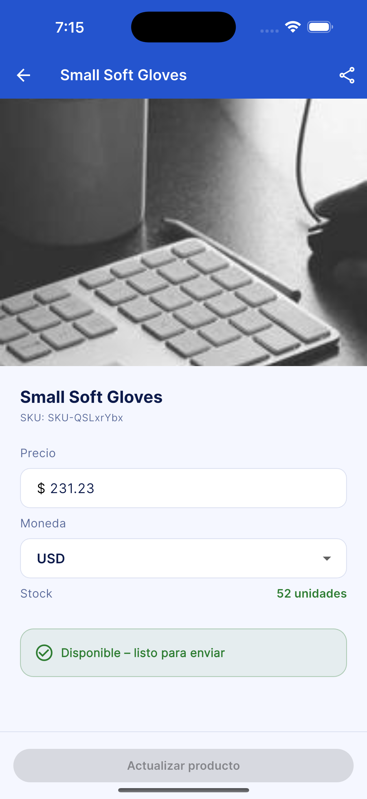
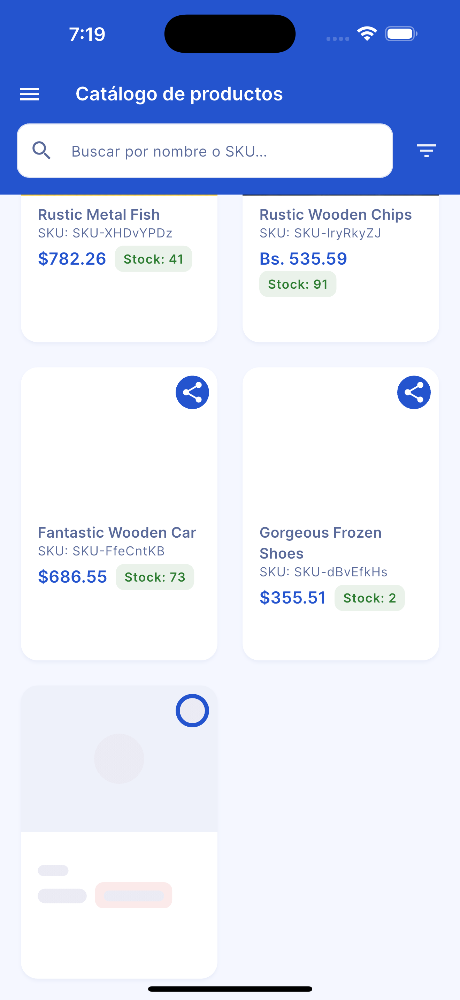
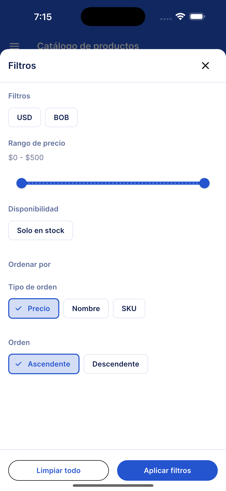
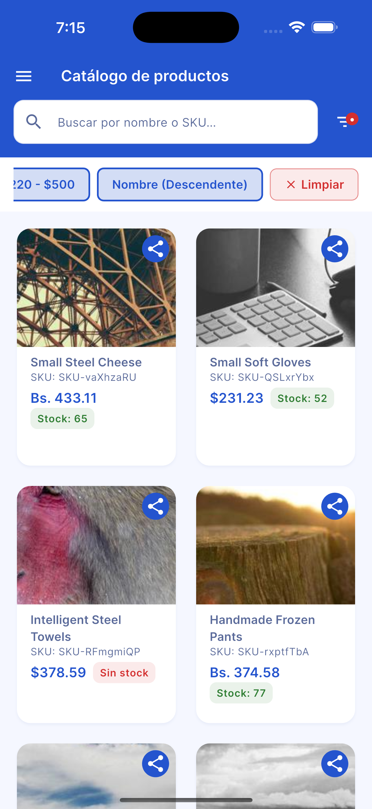
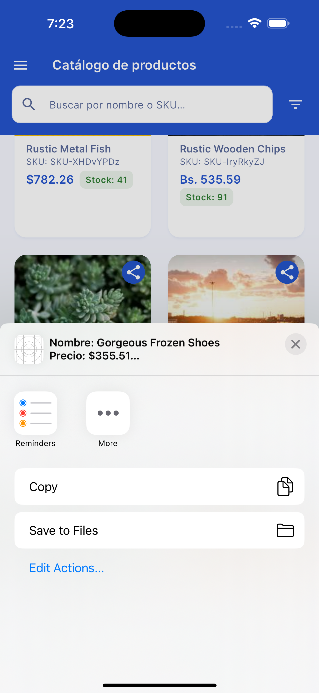
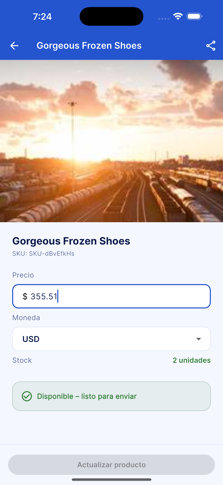
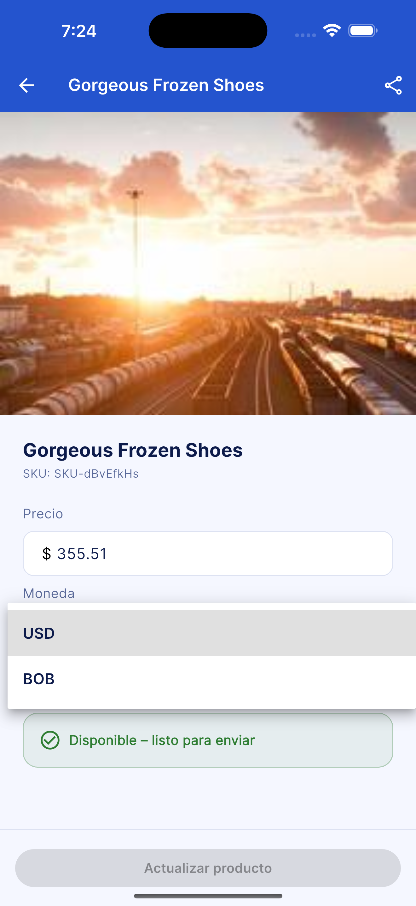
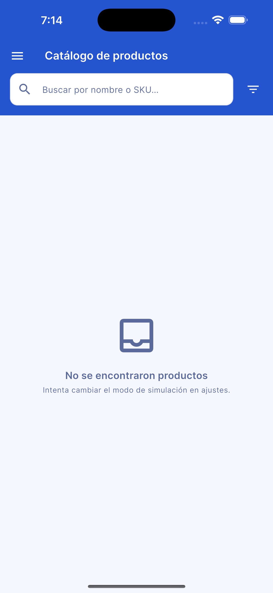
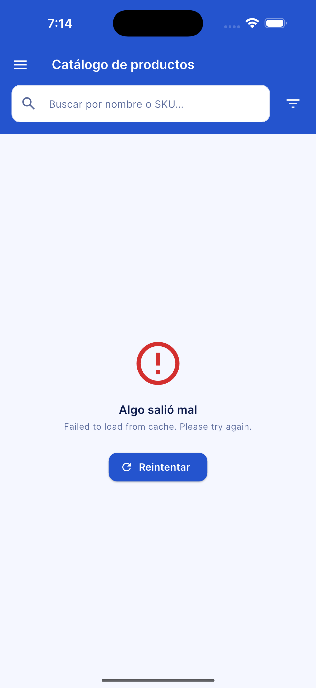

# Catálogo de Productos

Aplicación móvil desarrollada en Flutter que permite explorar, filtrar, compartir y editar productos de un catálogo.

---

## Cómo correr el proyecto

### Requisitos previos

- Flutter SDK **≥ 3.9.2**
- Dart SDK **≥ 3.9.2**
- Un dispositivo físico o emulador (Android / iOS)

### Pasos

```bash
# 1. Clonar el repositorio
git clone <url-del-repositorio>
cd product_catalog_test

# 2. Instalar dependencias
flutter pub get

# 3. Correr la aplicación
flutter run
```

> Para seleccionar un dispositivo específico: `flutter run -d <device-id>`  
> Para listar dispositivos disponibles: `flutter devices`

### Correr los tests

```bash
flutter test
```

---

## Uso de la aplicación

### Pantalla de inicio

Al abrir la app, se muestra una pantalla de carga mientras se inicializa la base de datos local con productos generados automáticamente.

| Cargando | Lista de productos | Detalle del producto |
|---|---|---|
|  |  |  |

### Explorar el catálogo

La pantalla principal muestra los productos en una grilla. Puedes hacer **scroll** hacia abajo para cargar más productos de forma paginada. Al llegar al final de la lista se muestra un indicador de carga mientras se obtiene la siguiente página.

| Scroll / paginación |
|---|
|  |

### Buscar y filtrar

Usa la barra de búsqueda para encontrar productos por **nombre o SKU**. El botón de filtros (ícono de embudo) abre un panel deslizable donde puedes combinar múltiples criterios:

- **Moneda** – USD o BOB
- **Rango de precio** – slider de mínimo y máximo
- **Disponibilidad** – solo productos en stock
- **Ordenar por** – precio, nombre o SKU (ascendente / descendente)

Los filtros activos se muestran como chips encima de la grilla y pueden limpiarse individualmente o todos a la vez.

| Filtros | Chips activos |
|---|---|
|  |  |

### Compartir un producto

Cada tarjeta de producto tiene un botón de compartir (ícono de flecha). Al tocarlo se abre el selector de apps del sistema con el nombre, precio y SKU del producto. También está disponible desde la pantalla de detalle.

| Compartir |
|---|
|  |

### Ver y editar un producto

Toca cualquier tarjeta para abrir el detalle del producto. Desde allí puedes modificar el **precio** y la **moneda** y guardar los cambios con el botón *Actualizar producto*. Los cambios persisten en la base de datos local.

| Detalle | Edición |
|---|---|
|  |  |

### Simulación de estados

El panel de **Ajustes** (ícono de menú en el AppBar) permite cambiar el modo de simulación para probar distintos escenarios sin modificar código:

| Modo | Comportamiento |
|---|---|
| **Éxito** | Los productos cargan normalmente |
| **Vacío** | Se muestra el estado de lista vacía |
| **Error** | Se muestra el estado de error con botón de reintentar |

| Estado vacío | Estado de error |
|---|---|
|  |  |

---

## Decisiones técnicas

### Arquitectura limpia (Clean Architecture)

El proyecto está organizado en capas bien definidas que separan las responsabilidades de cada parte del sistema:

```
lib/
├── shared/               # Código transversal a todas las features
│   ├── data/             # Modelos Hive, datasources, repositorios
│   ├── domain/           # Entidades, value objects, contratos de repositorio
│   └── presentation/     # Widgets reutilizables
└── features/
    ├── product_list/     # BLoC + casos de uso de listado
    ├── product_detail/   # Cubit + casos de uso de detalle/edición
    ├── settings/         # Cubit de configuración de simulación
    └── startup/          # Cubit de inicialización + datasources locales
```

Cada feature sigue el mismo patrón de tres capas:

- **Data** – datasources, modelos de persistencia (Hive), implementaciones de repositorio
- **Domain** – entidades inmutables (Freezed), casos de uso, interfaces de repositorio
- **Presentation** – BLoC/Cubit, páginas y widgets

Esta separación hizo posible añadir y modificar features de forma independiente, permitiendo alcanzar un gran número de funcionalidades en el tiempo disponible sin que los cambios en una capa afectaran a las demás.

### Gestión de estado

- **BLoC** para la lista de productos, donde los eventos (búsqueda, filtrado, paginación, refresco) se manejan de forma explícita y predecible.
- **Cubit** para estados más simples como el detalle del producto, la edición y los ajustes.
- La inyección de dependencias se centraliza con **GetIt**, con funciones de inicialización por feature para mantener el registro organizado.

### Inicialización y persistencia de datos (feature `startup`)

Para simular una API real con paginación y soporte de edición persistente, el flujo de inicio funciona así:

1. Al arrancar la app, **`LocalFakerProductDataSource`** genera una lista de productos usando el paquete `faker_dart`.
2. Esos productos se insertan en una base de datos **Hive** local a través de **`ProductHiveDataSource`**.
3. Todas las llamadas posteriores (listado paginado, búsqueda, filtrado, edición) operan contra Hive, lo que replica el comportamiento de un backend real con persistencia de cambios.

Este diseño permite que la pantalla de simulación de errores/vacío también funcione correctamente, ya que el datasource mock respeta el modo de simulación configurado en ajustes.

### Funcionalidades adicionales implementadas

Se completaron todos los bonus features propuestos a excepción de una capa de autenticación (Auth), decisión tomada conscientemente para utilizar el tiempo y esfuerzo disponible a la estructura central de gestión de productos:

- Paginación (scroll infinito)
- Filtros combinados (moneda, precio, stock, orden)
- Skeleton loading con `skeletonizer`
- Simulación de estados (éxito / vacío / error)
- Tests unitarios y de widget con `mockito`
- Telemetría
- Enfoque al diseño de pantallas.
- Capa de autenticación (Auth) — no implementada intencionalmente

### Stack principal

| Paquete | Uso |
|---|---|
| `flutter_bloc` | Gestión de estado (BLoC + Cubit) |
| `get_it` | Inyección de dependencias |
| `go_router` | Navegación declarativa |
| `hive` + `hive_flutter` | Persistencia local |
| `freezed` | Value objects e inmutabilidad |
| `faker_dart` | Generación de datos de prueba |
| `share_plus` | Compartir contenido nativo |
| `skeletonizer` | Skeleton loading |
| `google_fonts` | Tipografía |
| `mockito` | Mocks para tests |

---

## Posibles mejoras

### 1. Capa de autenticación

Agregar un flujo de **Sign In / Sign Up** con manejo de sesión. Esto encajaría naturalmente en la arquitectura como una nueva feature (`auth`) con su propio repositorio, casos de uso y cubits, sin modificar las features existentes.

### 2. Formulario de edición del producto

El estado del formulario de edición actualmente se gestiona directamente en el cubit con campos sueltos. Una mejora sería modelar el estado del formulario como un value object inmutable (Freezed) que encapsule los campos, su validación y el estado `dirty/pristine` de cada uno. Esto haría la UI más predecible y simplificaría la lógica de habilitación del botón de guardar.

### 3. Animación y posicionamiento del indicador de carga de más productos

Cuando se llega al final de la lista paginada, la transición entre el skeleton de carga y el indicador de fin tiene una animación brusca. Esto podría mejorarse con un widget de fin de lista dedicado, una animación de `AnimatedSwitcher` más suave y una mejor gestión del estado `NoMore` en el BLoC para evitar el parpadeo visual.

